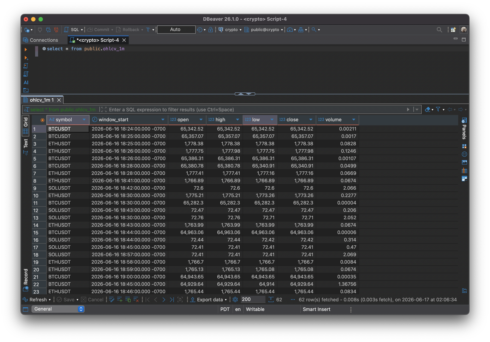
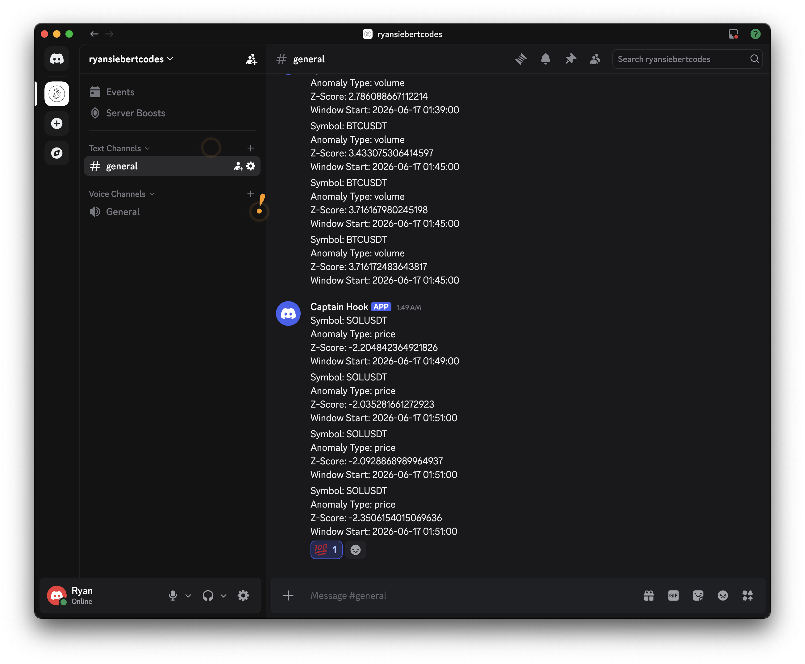

# crypto-streaming-pipeline

Real-time crypto trade ingestion with Kafka + PySpark — live OHLCV candles, Z-score anomaly detection, Discord webhook alerts, and a dbt analytics layer.

## Architecture

```
Binance US WebSocket (BTCUSDT, ETHUSDT, SOLUSDT)
      ↓
  Producer (Python)
      ↓
  Kafka topic: raw-trades
      ↓
  Spark Structured Streaming
      ├── Tumbling 1-min window ──→ ohlcv_1m (PostgreSQL)
      └── Z-score (close/volume) ──→ anomalies (PostgreSQL)
                                            ↓
                                      Discord webhook alert
                                            
  dbt (batch layer on top of PostgreSQL)
      ├── ohlcv_1h  ── hourly candle rollup
      └── anomaly_summary ── daily anomaly counts + severity
```

## Tech Stack

| Layer | Tool |
|---|---|
| Message broker | Apache Kafka (KRaft mode) |
| Stream processor | Apache Spark 4 (PySpark Structured Streaming) |
| Data source | Binance US WebSocket |
| Storage | PostgreSQL (Snowflake port available via `SINK=snowflake`) |
| Analytics | dbt |
| Infrastructure | Docker Compose |
| Alerting | Discord webhook |

## Prerequisites

- Docker Desktop
- Python 3.12+
- Java 17+ (`brew install openjdk@17`)

## Setup

```bash
# 1. Start Kafka and PostgreSQL
docker compose up -d

# 2. Install Python dependencies
make install

# 3. Copy environment config
cp .env.example .env  # fill in DB credentials and Discord webhook URL

# 4. Start the Binance WebSocket producer (terminal 1)
make producer

# 5. Start the Spark streaming job (terminal 2)
make stream

# 6. Run dbt models and tests
make dbt-all
```

## Make Targets

| Command | Description |
|---|---|
| `make producer` | Start Binance WebSocket → Kafka producer |
| `make stream` | Start Spark Structured Streaming job |
| `make stream-fresh` | Wipe checkpoint and restart stream |
| `make dbt-run` | Build dbt models |
| `make dbt-test` | Run dbt data quality tests |
| `make dbt-all` | Run and test dbt models |
| `make install` | Install Python dependencies |
| `make freeze` | Update requirements.txt |

## Database Schema

**`ohlcv_1m`** — one row per symbol per minute

| Column | Type | Description |
|---|---|---|
| symbol | TEXT | Trading pair (e.g. BTCUSDT) |
| window_start | TIMESTAMPTZ | Start of the 1-minute window |
| open | NUMERIC | First price in window |
| high | NUMERIC | Highest price in window |
| low | NUMERIC | Lowest price in window |
| close | NUMERIC | Last price in window |
| volume | NUMERIC | Total quantity traded |

**`anomalies`** — detected anomaly events

| Column | Type | Description |
|---|---|---|
| id | SERIAL | Primary key |
| symbol | TEXT | Trading pair |
| detected_at | TIMESTAMPTZ | When the anomaly was flagged |
| anomaly_type | TEXT | `price` or `volume` |
| z_score | NUMERIC | Deviation from rolling mean |
| ohlcv_ref | TIMESTAMPTZ | Reference candle window |



## Anomaly Detection

Z-score computed over a rolling 20-candle lookback window per symbol. Alerts fire to Discord when `abs(z_score) > 2.0` on close price or volume. Requires at least 5 completed candles before detection activates.



## Sink Abstraction

The write layer is abstracted behind `BaseSink`. PostgreSQL is the default. To port to Snowflake, set `SINK=snowflake` in `.env` — `SnowflakeSink` implements the same interface.

## dbt Models

| Model | Description |
|---|---|
| `ohlcv_1h` | Hourly OHLCV candles rolled up from 1-minute data |
| `anomaly_summary` | Daily anomaly counts and z-score statistics per symbol |
